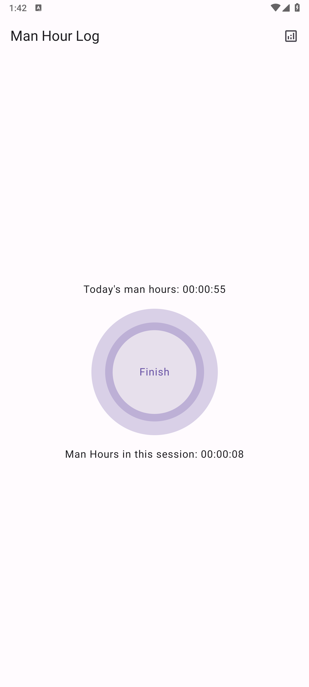
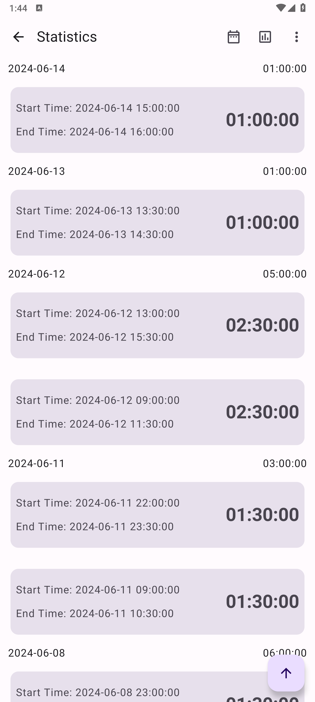
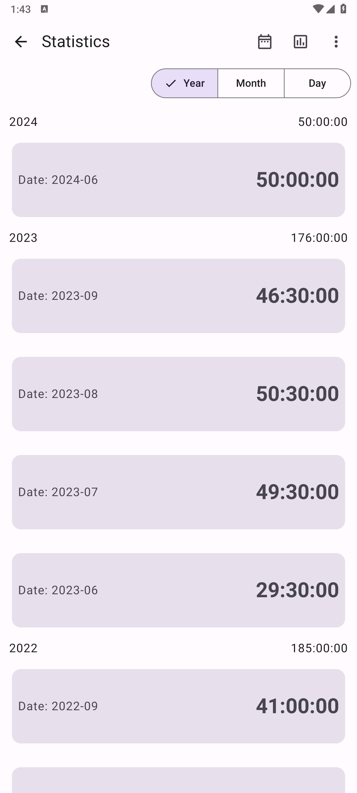
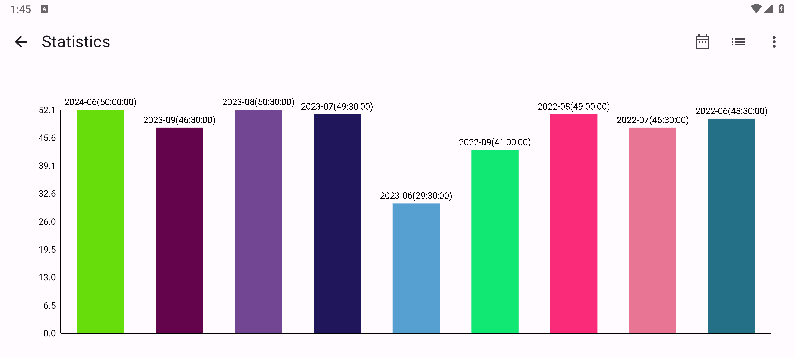

# 简介
这是一个帮助记录工时的小工具，适用于自由工作者或无固定工作时间但需要记录实际工时的大佬们。

使用非常简单，首页只有一个按钮，点击即可开始/结束一次工时记录，开始记录后不需要在后台运行，可以直接杀掉 APP 进程，只需要在本次工作结束后重新打开 APP 点击 Finish 即可完成一次记录。

## 截图
|  |  |
|-------------------------------|-------------------------------|
|  |  |

## 功能特性
1. 一键记录，无需后台运行
2. 支持按 年、月、日 不同视图范围查看统计数据
3. 支持导出、导入 CSV 文件
4. 支持查看图表统计
5. 支持自由筛选查看统计时间范围
6. 支持右滑删除数据

# 注意事项和规则

1. APP 统计/筛选 等数据操作时使用的均为 开始时间 字段。如，某次工作记录在 2024.06.25 22:00 开始，2024.06.26 01:30 结束，则统计数据时会将其记录为 2024.06.24 增加工时 3.5 小时。
2. APP 统计页面缺省筛选时间范围为当前日期这一年，且筛选时间范围会同步影响所有操作。
3. APP 图表统计仅支持 “Year” 视图。
4. APP 导入数据仅支持在 “Day” 视图下导出的数据。
5. APP 统计界面点击某个 Item 后自动更改时间筛选范围为当前 Item 且跳转视图至下一级。如，在 “Year” 视图点击 “2024-06” Item 会将时间筛选范围更改为 “2024.06.01 - 2024.06.30”，且切换至 “Month” 视图

## 样例数据

可将下面数据复制并保存为 xxx.csv 文件，在 APP 中导入体验 APP 功能。

```text
Start Time,End Time,Total Man Hours
2024-06-04 14:00:00,2024-06-04 16:00:00,02:00:00
2024-06-04 20:00:00,2024-06-04 21:30:00,01:30:00
2024-06-04 22:00:00,2024-06-04 23:30:00,01:30:00
2024-06-05 10:00:00,2024-06-05 11:30:00,01:30:00
2024-06-05 14:00:00,2024-06-05 18:00:00,04:00:00
2024-06-05 20:00:00,2024-06-05 22:30:00,02:30:00
2024-06-06 09:00:00,2024-06-06 11:30:00,02:30:00
2024-06-06 13:00:00,2024-06-06 17:00:00,04:00:00
2024-06-06 20:00:00,2024-06-06 22:00:00,02:00:00
2024-06-07 09:00:00,2024-06-07 11:30:00,02:30:00
2024-06-07 13:00:00,2024-06-07 15:00:00,02:00:00
2024-06-08 13:00:00,2024-06-08 15:30:00,02:30:00
2024-06-08 20:00:00,2024-06-08 22:00:00,02:00:00
2024-06-08 23:00:00,2024-06-08 00:30:00,01:30:00
2024-06-11 09:00:00,2024-06-11 10:30:00,01:30:00
2024-06-11 22:00:00,2024-06-11 23:30:00,01:30:00
2024-06-12 09:00:00,2024-06-12 11:30:00,02:30:00
2024-06-12 13:00:00,2024-06-12 15:30:00,02:30:00
2024-06-13 10:00:00,2024-06-13 11:30:00,01:30:00
2024-06-13 13:30:00,2024-06-13 14:30:00,01:00:00
2024-06-14 15:00:00,2024-06-14 16:00:00,01:00:00
2024-06-15 09:00:00,2024-06-15 12:00:00,03:00:00
2024-06-15 13:00:00,2024-06-15 18:00:00,05:00:00
2023-06-04 14:00:00,2023-06-04 16:00:00,02:00:00
2023-06-04 20:00:00,2023-06-04 21:30:00,01:30:00
2023-06-04 22:00:00,2023-06-04 23:30:00,01:30:00
2023-06-05 10:00:00,2023-06-05 11:30:00,01:30:00
2023-06-05 14:00:00,2023-06-05 18:00:00,04:00:00
2023-06-05 20:00:00,2023-06-05 22:30:00,02:30:00
2023-06-12 09:00:00,2023-06-12 11:30:00,02:30:00
2023-06-12 13:00:00,2023-06-12 15:30:00,02:30:00
2023-06-13 10:00:00,2023-06-13 11:30:00,01:30:00
2023-06-13 13:30:00,2023-06-13 14:30:00,01:00:00
2023-06-14 15:00:00,2023-06-14 16:00:00,01:00:00
2023-06-15 09:00:00,2023-06-15 12:00:00,03:00:00
2023-06-15 13:00:00,2023-06-15 18:00:00,05:00:00
2023-07-04 14:00:00,2023-07-04 16:00:00,02:00:00
2023-07-04 20:00:00,2023-07-04 21:30:00,01:30:00
2023-07-04 22:00:00,2023-07-04 23:30:00,01:30:00
2023-07-05 10:00:00,2023-07-05 11:30:00,01:30:00
2023-07-05 14:00:00,2023-07-05 18:00:00,04:00:00
2023-07-05 20:00:00,2023-07-05 22:30:00,02:30:00
2023-07-06 09:00:00,2023-07-06 11:30:00,02:30:00
2023-07-06 13:00:00,2023-07-06 17:00:00,04:00:00
2023-07-06 20:00:00,2023-07-06 22:00:00,02:00:00
2023-07-07 09:00:00,2023-07-07 11:30:00,02:30:00
2023-07-07 13:00:00,2023-07-07 15:00:00,02:00:00
2023-07-08 13:00:00,2023-07-08 15:30:00,02:30:00
2023-07-08 20:00:00,2023-07-08 22:00:00,02:00:00
2023-07-08 23:00:00,2023-07-08 00:30:00,01:30:00
2023-07-11 09:00:00,2023-07-11 10:30:00,01:30:00
2023-07-11 22:00:00,2023-07-11 23:30:00,01:30:00
2023-07-12 09:00:00,2023-07-12 11:30:00,02:30:00
2023-07-12 13:00:00,2023-07-12 15:30:00,02:30:00
2023-07-13 10:00:00,2023-07-13 11:30:00,01:30:00
2023-07-15 09:00:00,2023-07-15 12:00:00,03:00:00
2023-07-15 13:00:00,2023-07-15 18:00:00,05:00:00
2023-08-04 14:00:00,2023-08-04 16:00:00,02:00:00
2023-08-04 20:00:00,2023-08-04 21:30:00,01:30:00
2023-08-04 22:00:00,2023-08-04 23:30:00,01:30:00
2023-08-05 10:00:00,2023-08-05 11:30:00,01:30:00
2023-08-05 14:00:00,2023-08-05 18:00:00,04:00:00
2023-08-05 20:00:00,2023-08-05 22:30:00,02:30:00
2023-08-06 09:00:00,2023-08-06 11:30:00,02:30:00
2023-08-06 13:00:00,2023-08-06 17:00:00,04:00:00
2023-08-06 20:00:00,2023-08-06 22:00:00,02:00:00
2023-08-07 09:00:00,2023-08-07 11:30:00,02:30:00
2023-08-07 13:00:00,2023-08-07 15:00:00,02:00:00
2023-08-08 13:00:00,2023-08-08 15:30:00,02:30:00
2023-08-08 20:00:00,2023-08-08 22:00:00,02:00:00
2023-08-08 23:00:00,2023-08-08 00:30:00,01:30:00
2023-08-11 09:00:00,2023-08-11 10:30:00,01:30:00
2023-08-11 22:00:00,2023-08-11 23:30:00,01:30:00
2023-08-12 09:00:00,2023-08-12 11:30:00,02:30:00
2023-08-12 13:00:00,2023-08-12 15:30:00,02:30:00
2023-08-13 10:00:00,2023-08-13 11:30:00,01:30:00
2023-08-13 13:30:00,2023-08-13 14:30:00,01:00:00
2023-08-15 09:00:00,2023-08-15 12:00:00,03:00:00
2023-08-15 13:00:00,2023-08-15 18:00:00,05:00:00
2023-09-04 14:00:00,2023-09-04 16:00:00,02:00:00
2023-09-04 20:00:00,2023-09-04 21:30:00,01:30:00
2023-09-04 22:00:00,2023-09-04 23:30:00,01:30:00
2023-09-05 10:00:00,2023-09-05 11:30:00,01:30:00
2023-09-05 14:00:00,2023-09-05 18:00:00,04:00:00
2023-09-05 20:00:00,2023-09-05 22:30:00,02:30:00
2023-09-06 09:00:00,2023-09-06 11:30:00,02:30:00
2023-09-06 13:00:00,2023-09-06 17:00:00,04:00:00
2023-09-06 20:00:00,2023-09-06 22:00:00,02:00:00
2023-09-07 09:00:00,2023-09-07 11:30:00,02:30:00
2023-09-07 13:00:00,2023-09-07 15:00:00,02:00:00
2023-09-08 13:00:00,2023-09-08 15:30:00,02:30:00
2023-09-08 20:00:00,2023-09-08 22:00:00,02:00:00
2023-09-08 23:00:00,2023-09-08 00:30:00,01:30:00
2023-09-11 09:00:00,2023-09-11 10:30:00,01:30:00
2023-09-11 22:00:00,2023-09-11 23:30:00,01:30:00
2023-09-13 10:00:00,2023-09-13 11:30:00,01:30:00
2023-09-13 13:30:00,2023-09-13 14:30:00,01:00:00
2023-09-14 15:00:00,2023-09-14 16:00:00,01:00:00
2023-09-15 09:00:00,2023-09-15 12:00:00,03:00:00
2023-09-15 13:00:00,2023-09-15 18:00:00,05:00:00
2022-06-04 14:00:00,2022-06-04 16:00:00,02:00:00
2022-06-04 20:00:00,2022-06-04 21:30:00,01:30:00
2022-06-04 22:00:00,2022-06-04 23:30:00,01:30:00
2022-06-05 10:00:00,2022-06-05 11:30:00,01:30:00
2022-06-05 14:00:00,2022-06-05 18:00:00,04:00:00
2022-06-05 20:00:00,2022-06-05 22:30:00,02:30:00
2022-06-06 09:00:00,2022-06-06 11:30:00,02:30:00
2022-06-06 13:00:00,2022-06-06 17:00:00,04:00:00
2022-06-06 20:00:00,2022-06-06 22:00:00,02:00:00
2022-06-07 09:00:00,2022-06-07 11:30:00,02:30:00
2022-06-07 13:00:00,2022-06-07 15:00:00,02:00:00
2022-06-08 13:00:00,2022-06-08 15:30:00,02:30:00
2022-06-08 20:00:00,2022-06-08 22:00:00,02:00:00
2022-06-08 23:00:00,2022-06-08 00:30:00,01:30:00
2022-06-11 09:00:00,2022-06-11 10:30:00,01:30:00
2022-06-11 22:00:00,2022-06-11 23:30:00,01:30:00
2022-06-12 09:00:00,2022-06-12 11:30:00,02:30:00
2022-06-12 13:00:00,2022-06-12 15:30:00,02:30:00
2022-06-13 10:00:00,2022-06-13 11:30:00,01:30:00
2022-06-13 13:30:00,2022-06-13 14:30:00,01:00:00
2022-06-14 15:00:00,2022-06-14 16:00:00,01:00:00
2022-06-15 13:00:00,2022-06-15 18:00:00,05:00:00
2022-07-04 14:00:00,2022-07-04 16:00:00,02:00:00
2022-07-04 20:00:00,2022-07-04 21:30:00,01:30:00
2022-07-04 22:00:00,2022-07-04 23:30:00,01:30:00
2022-07-05 10:00:00,2022-07-05 11:30:00,01:30:00
2022-07-05 14:00:00,2022-07-05 18:00:00,04:00:00
2022-07-05 20:00:00,2022-07-05 22:30:00,02:30:00
2022-07-06 09:00:00,2022-07-06 11:30:00,02:30:00
2022-07-06 13:00:00,2022-07-06 17:00:00,04:00:00
2022-07-06 20:00:00,2022-07-06 22:00:00,02:00:00
2022-07-07 09:00:00,2022-07-07 11:30:00,02:30:00
2022-07-07 13:00:00,2022-07-07 15:00:00,02:00:00
2022-07-08 13:00:00,2022-07-08 15:30:00,02:30:00
2022-07-08 20:00:00,2022-07-08 22:00:00,02:00:00
2022-07-08 23:00:00,2022-07-08 00:30:00,01:30:00
2022-07-11 09:00:00,2022-07-11 10:30:00,01:30:00
2022-07-11 22:00:00,2022-07-11 23:30:00,01:30:00
2022-07-13 10:00:00,2022-07-13 11:30:00,01:30:00
2022-07-13 13:30:00,2022-07-13 14:30:00,01:00:00
2022-07-14 15:00:00,2022-07-14 16:00:00,01:00:00
2022-07-15 09:00:00,2022-07-15 12:00:00,03:00:00
2022-07-15 13:00:00,2022-07-15 18:00:00,05:00:00
2022-08-04 14:00:00,2022-08-04 16:00:00,02:00:00
2022-08-04 20:00:00,2022-08-04 21:30:00,01:30:00
2022-08-04 22:00:00,2022-08-04 23:30:00,01:30:00
2022-08-05 10:00:00,2022-08-05 11:30:00,01:30:00
2022-08-05 14:00:00,2022-08-05 18:00:00,04:00:00
2022-08-05 20:00:00,2022-08-05 22:30:00,02:30:00
2022-08-06 09:00:00,2022-08-06 11:30:00,02:30:00
2022-08-06 13:00:00,2022-08-06 17:00:00,04:00:00
2022-08-06 20:00:00,2022-08-06 22:00:00,02:00:00
2022-08-07 09:00:00,2022-08-07 11:30:00,02:30:00
2022-08-07 13:00:00,2022-08-07 15:00:00,02:00:00
2022-08-08 20:00:00,2022-08-08 22:00:00,02:00:00
2022-08-08 23:00:00,2022-08-08 00:30:00,01:30:00
2022-08-11 09:00:00,2022-08-11 10:30:00,01:30:00
2022-08-11 22:00:00,2022-08-11 23:30:00,01:30:00
2022-08-12 09:00:00,2022-08-12 11:30:00,02:30:00
2022-08-12 13:00:00,2022-08-12 15:30:00,02:30:00
2022-08-13 10:00:00,2022-08-13 11:30:00,01:30:00
2022-08-13 13:30:00,2022-08-13 14:30:00,01:00:00
2022-08-14 15:00:00,2022-08-14 16:00:00,01:00:00
2022-08-15 09:00:00,2022-08-15 12:00:00,03:00:00
2022-08-15 13:00:00,2022-08-15 18:00:00,05:00:00
2022-09-04 14:00:00,2022-09-04 16:00:00,02:00:00
2022-09-04 20:00:00,2022-09-04 21:30:00,01:30:00
2022-09-04 22:00:00,2022-09-04 23:30:00,01:30:00
2022-09-05 10:00:00,2022-09-05 11:30:00,01:30:00
2022-09-05 14:00:00,2022-09-05 18:00:00,04:00:00
2022-09-05 20:00:00,2022-09-05 22:30:00,02:30:00
2022-09-06 09:00:00,2022-09-06 11:30:00,02:30:00
2022-09-08 13:00:00,2022-09-08 15:30:00,02:30:00
2022-09-08 20:00:00,2022-09-08 22:00:00,02:00:00
2022-09-08 23:00:00,2022-09-08 00:30:00,01:30:00
2022-09-11 09:00:00,2022-09-11 10:30:00,01:30:00
2022-09-11 22:00:00,2022-09-11 23:30:00,01:30:00
2022-09-12 09:00:00,2022-09-12 11:30:00,02:30:00
2022-09-12 13:00:00,2022-09-12 15:30:00,02:30:00
2022-09-13 10:00:00,2022-09-13 11:30:00,01:30:00
2022-09-13 13:30:00,2022-09-13 14:30:00,01:00:00
2022-09-14 15:00:00,2022-09-14 16:00:00,01:00:00
2022-09-15 09:00:00,2022-09-15 12:00:00,03:00:00
2022-09-15 13:00:00,2022-09-15 18:00:00,05:00:00
```